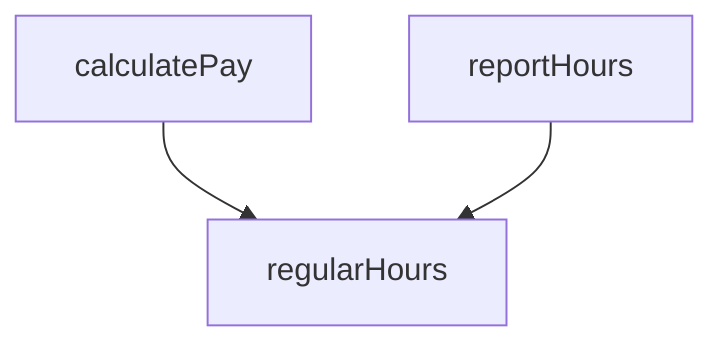
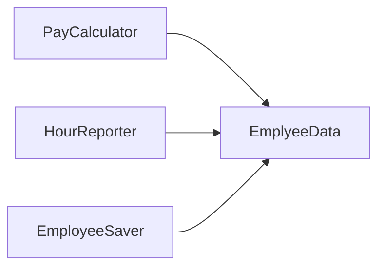
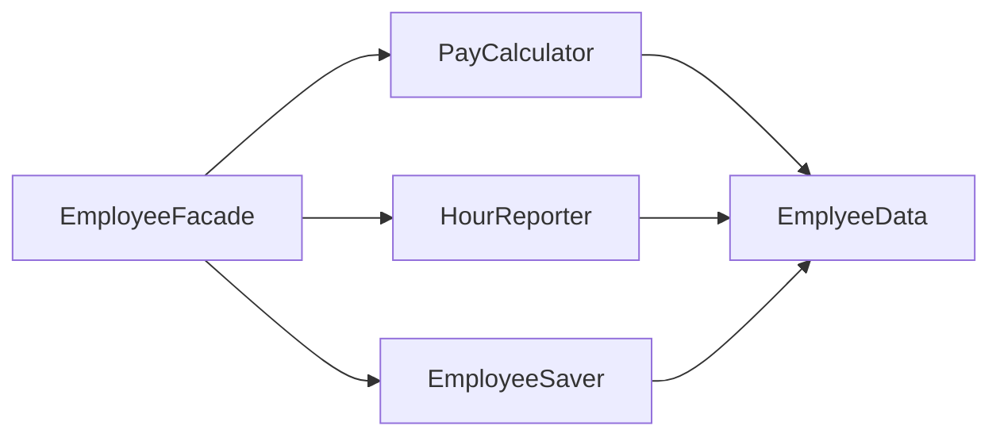
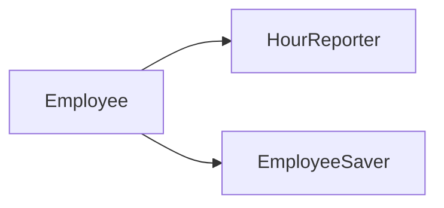
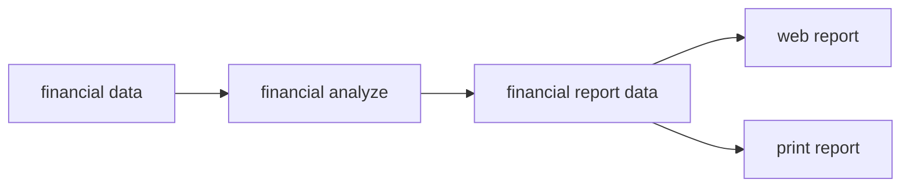
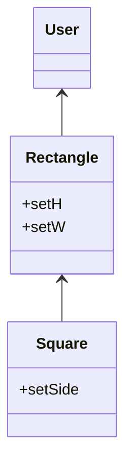
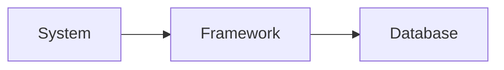

# Clean architecture: A craftsman's guide to software structure and design

- Author:: Robert C. Martin, Robert C. Martin
- Year:: 2018
- Citekey:: martinCleanArchitectureCraftsman2018
- ZoteroURI:: [Open in Zotero: Clean architecture: A craftsman's guide to software structure and design](zotero://select/items/@martinCleanArchitectureCraftsman2018)
- Abstract:: Building upon the success of best-sellers The Clean Coder and Clean Code, legendary software craftsman Robert C. "Uncle Bob" Martin shows how to bring greater professionalism and discipline to application architecture and design. As with his other books, Martin's Clean Architecture doesn't merely present multiple choices and options, and say "use your best judgment": it tells you what choices to make, and why those choices are critical to your success. Martin offers direct, no-nonsense answers to key architecture and design questions like: What are the best high level structures for different kinds of applications, including web, database, thick-client, console, and embedded apps? What are the core principles of software architecture? What is the role of the architect, and what is he/she really trying to achieve? What are the core principles of software design? How do designs and architectures go wrong, and what can you do about it? What are the disciplines and practices of professional architects and designers? Clean Architecture is essential reading for every software architect, systems analyst, system designer, and software manager – and for any programmer who aspires to these roles or is impacted by their work
- 外链： [目录 · Clean_Architecture_zh (gitbooks.io)](https://wonderwater.gitbooks.io/clean_architecture_zh/content/SUMMARY.html)

# 软件架构

## 软件架构的目标

软件设计的目标是最小化人力资源的需求以构建和维护所需的软件系统。

- 使软件可容忍被改动。
- 使软件更容易被理解。
- 构建可在多个软件系统中复用的组件。

## 软件架构的必要性

> 行为价值：软件的功能
> 架构价值：软件的可维护性和可拓展性

软件提供两种价值，行为价值和架构价值。行为价值是短期的，架构价值是长期的。因为一个软件没有架构价值，其价值将随着时间而消逝。并引用紧急和重要四象限阐述，架构价值是优于行为价值的。

## 编程范式

- 结构化编程：对程序控制权的直接转移进行了限制——限制 goto 语句
- 面向对象编程：对程序控制权的间接转移进行了限制——利用多态特性，构造依赖反转，从而使得各组件相互独立
- 函数式编程：对程序的赋值进行了限制——函数式编程的变量是不可变的，这为了避免并发问题。因此现在都是将可变的组件和不可变的组件分开，尽量减少可变的组件。

### 结构化编程

结构化编程：采用主程序，子程序，条件语句，循环语句等的编程方式。这样的编程方式禁止使用 goto 语句。

结构化编程的基础思想是将大问题化为小问题，小问题用基本语句进行解决。这在形式逻辑中证明了其完备性。但在实际编程中不会将每一部分严格证明的将代码写下来，借助科学的方法（即可证伪性），利用测试检验每个部分的有效性。

### 面向对象编程

什么是面向对象编程？面向对象编程就是以对象为手段来对源代码中的依赖关系进行控制的能力，这种能力让软件架构师可以构建出某种插件式架构，让高层策略性组件与底层实现性组件相分离，底层组件可必编译成插件，实现独立于高层组件的开发和部署。

该书阐述了其三个特性，其中多态是核心特性：

- 封装：C 语言有完美封装（.h 文件屏蔽了所有细节，包括变量），而其它面向对象语言或多或少没有完美封装
- 继承：面向对象编程语言将继承做得很简单而已，C 语言照样能实现
- 多态：依赖反转，使得每个组件都能独立部署。简单理解就是预留接口，其它实现了该接口的都能接入系统。这样主系统依赖子系统的关系反转了，子系统需要实现主系统的接口方法。

### 函数式编程

> 函数式编程语言中的变量（Variable）是不可变（Vary）的。

函数式编程范式基于 $\lambda$ 演算，它清晰地定义什么是一个可计算函数，而任何可计算函数都能以这种形式表达和求值，它能模拟单一磁带图灵机的计算过程，是函数式编程范式的理论基础。

为什么不可变性是软件架构设计需要考虑的重点呢？为什么软件架构帅要操心变量的可变性呢？答案显而易见：所有的竞争问题、死锁问题、并发更新问题都是由可变变量导致的。如果变量永远不会被更改，那就不可能产生竞争或者并发更新问题。如果锁状态是不可变的，那就永远不会产生死锁问题。

一种常见方式是将应用程序，或者是应用程序的内部服务进行切分，划分为可变的和不可变的两种组件。不可变组件用纯函数的方式来执行任务，期间不更改任何状态。这些不可变的组件将通过与一个或多个非函数式组件通信的方式来修改变量状态。这也是 react 所倡导的方式。

# 设计原则

Solid 设计原则：

- SRP：单一职责原则。 该设计原则是某于康威圧律（Conway's Law）的一个推论——一个软件系统的最佳结构高度依赖于开发这个系统的组织的内部结构。这样，每个软件模块都有且只有一个需要被改变的理由。
- OCP：开闭原则。 该设计原则是由 Bertrand Meyer 在 20 世纪 80 年代大力推广的，其核心要素是：如果软件系统想要更容易被改变，那么其设计就必须允许新增代码来修改系统行为，而非只能靠修改原来的代码。
- LSP：里氏替换原则。 该设计原则是 Barbara Liskov 在 1988 年提出的一个著名的子类型定义。简单来说，这项原则的意思是如果想用可替换的组件来构建软件系统，那么这些组件就必须遵守同一个约定，以便让这些组件可以相互替换。否则就进行拓展，平级调用。
- ISP：接口隔离原则。 这项设计原则主要告诫软件设计师应该在设计中避免不必要的依赖。
- DIP：依赖反转原则。 该设计原则指出高层策略性的代码不应该依赖实现底层细节的代码，恰恰相反，那些实现底层细节的代码应该依赖高层策略性的代码。

## 单一职责原则

任何一个软件模块都应该只对某一类行为者负责。

最典型的例子就是多人修改同一篇文档发生冲突。

==示例== ：某个工资管理程序中的 Employee 类有三个函数 `calculatePay()`、`reportHours()` 和 `save()`。这个类的三个函数分别对应的是三类非常不同的行为者，违反了 SRP 设计原则。

- `calculatePay() ` 函数是由财务部门制定的，他们负责向 CFO 汇报。
- `reportHours()` 函数是由人力资源部门制定并使用的，他们负责向 COO 汇报。
- `save()` 函数是由 database manager 制定的，他们负责向 CTO 汇报。
- `regularHours`：共用的工具函数



CFO 团队如果需要修改计算工时的函数 `caculatePay`。如果上述内容都在一个类中，势必造成 `reportHours` 发生问题。

==解决办法== ：

1. 最简单直接的办法是将数据与函数分离，设计三个类共同使用一个不包括函数的、十分简单的 EmployeeData 类，每个类只包含与之相关的函数代码，互相不可见，这样就不存在互相依赖的情况了。这种解决方案的坏处在于：程序员现在需要在程序里处理三个类。



1. 使用 Facade 设计模式，这个 `EmployeeFacade` 是一个公用的类，包含后续单独计算各个项目的一些初始化或者复用代码。



1. 还有一些开发者倾向于将重要的业务规则和数据绑定在一起，即所有服务都单独导出，如下：



==总而言之，上面的每一个类都分别容纳了一组作用于相同作用域的函数，而在该作用域之外，它们各自的私有函数是互相不可见的。==

## 开闭原则

==设计原则：如果 A 组件不想被 B 组件上发生的修改所影响，那么就应该让 B 组件依赖于 A 组件。==具体操作就是让 A 预留一个接口，让 B 实现，这样就依赖反转了。

以一个例子来阐述：

> 假设我们现在要设计一个在 Web 页面上展示财务数据的系统，页面上的数据要可以滚动显示，其中负值应显示为红色。
> 接下来，该系统的所有者又要求同样的数据需要形成一个报表，该报表要能用黑白打印机打印，并且其报表格式要得到合理分页，每页都要包含页头、页尾及栏目名。同时，负值应该以括号表示。

_利用 SRP 原则确定代码数据流以形成数据结构_：



这里的核心就是将应用生成报表的过程拆分成两个不同的操作，即先计算报表数据，再生成具体的展示报表。

_确定源代码组件的依赖关系：_


其中：双实线是模块，单线箭头是直接依赖关系，空心箭头是接口依赖关系。`<I>` 是接口，`DS` 是数据结构。

如图所示：

- 将整个系统拆分为了：Database, Interactor, Controller, Presenter, View 五个部分，每个部分用双实线圈住，且都是单向依赖的。
- Interactor 组件是整个系统中最符合 OCP 的。发生在 Database、Controller、Presenter 甚至 View 上的修改都不会影响到 Interactor。为什么 Interactor 会被放在这么重要的位置上呢？因为它是该程序的业务逻辑所在之处，Interactor 中包含了其最高层次的应用策略。其他组件都只是负责处理周边的辅助逻辑，只有 Interactor 才是核心组件。
- 这里利用“层级”这个概念创造了一系列不同的保护层级。譬如，Interactor 是最高层的抽象，所以它被保护得最严密，而 Presenter 比 View 时层级高，但比 Controller 和 Interactor 的层级低。
- 反转依赖：inanciaIReportGenerator 和 FinancialDataMapper 之间的 Financial DataGateway 接口是为了反转 Interactor 与 Database 之间的依赖关系而产生的。同样的，FinancialReportPresenter 接口与两个 View 接口之间也类似于这种情况。
- 信息隐藏： FinancialReportRequester 接口的作用则完全不同，它的作用是保护 FinancialReportController 不过度依赖于 Interactor 的内部细节。如果没有这个接口，则 Controller 将会传递性地依赖于 FinancialEntities。

==总结：==

- 你要很强的拓展性，就尽量拆分成很细的模块，这样就通用了，但相应的复杂度就提升了，这是一个均衡。
- 确定组件间的单向依赖，这样低阶组件的修改就不会影响到高阶组件。
- 接口的作用有两个，一个是反转依赖，另一个是信息隐藏。

## 里氏替换原则

==设计原则：如果对于每个类型是 S 的对象 o1 都存在一个类型为 T 的对象 o2，能使操作 T 类型的程序 P 在用 o2 替换 o1 时行为保持不变，我们就可以将 S 称为 T 的子类型。 ==

>     我目前理解的意思是：如果想用可替换的组件来构建软件系统，那么这些组件就必须遵守同一个约定（至少接口都要一样），以便让这些组件可以相互替换。否则就进行拓展，平级调用。

_示例：长方形正方形问题_

Square 类并不是 Rectangle 类的子类型，因为 Rectangle 类的高和宽可以分别修改，而 Square 类的高和宽则必须一同修改。由于 User 类 始终认为自己在操作 Rectangle 类，因此会带来一些混淆。



```java
Rectangle r = …
r.setW(5);
r.setH(2);
assert(r.area() == 10);
```

很显然，如果上述代码在…处返回的是 Square 类，则最后的这个 assert 是不会成立的。如果想要防范这种违反 LSP 的行为，唯一的办法就是在 user 类中增加用于区分 Rectangle 和 Square 的检测逻辑（例如增加 if 语句）。但这样一来，user 为的行为又将依赖于它所使用的类，这两个类就不能互相替换了。

==总结==

- 架构上应扩展：如图所示，正方形不是长方形的子类型，不可在同一接口替换，得并排。

## 接口隔离原则

==设计原则： 依赖于一些你并不需要的东西可能会给你带来你意想不到的麻烦==



大多时候，模块依赖于更多它并需要的东西是很不利的。在源码层面很好解释，你得重新编译，重新部署，但在架构层面上也是很不利的。

考虑这么个例子，在系统 S 的架构。包含了框架 F，设想框架 F 的作者实现中绑定了特殊的数据库 D，那么 S 依赖于 F，F 依赖于 D。设想 D 包含了 F 并不使用的特性，而且 S 并不关心，那么改变 D 中的这些特性也许将使得 F 重新部署，进而重新部署 S，更糟的是，D 中的这些特性要是失败了，可能造成 F 和 S 也失败了。

## 依赖倒置原则

==设计原则：最灵活的系统应该是其中的源码依赖只指向抽象，而非具体实现。==

这意味着，稳定得软件架构避免依赖易变得具体类，倾向于使用稳定的抽象接口，可以总结为以下一组非常规范的代码实践：

- **别引用易变的具体实现类**。请引用抽象接口类。无论静态语言还是动态语言，这条规则都适用。这也给对象创建加了约束，进而迫使使用抽象工厂模式创建对象。
- **别从易变的具体实现类派生**。这条是上一条的推导，但这里特别提到。在静态语言中，继承是所有代码关系里最强，最死板的；因此，在使用时应该非常小心。在动态语言中，继承问题较少，但它仍然是个依赖 -- 谨慎总是最明智的选择。
- **别覆盖具体实现的函数**。具体实现的函数常常要求源码依赖。但你覆盖这些函数时，你无法消除这些依赖，事实上，你继承了他们。为了管理这些依赖，这应该把这个函数声明成抽象的，然后可以写多个实现。
- **别提任何的具体实现和易变类的名字**。这只是 DIP 本身的要求。

# 细节

这里的细节作者举了个例子：从架构的角度来看，数据库是一个非实体——它是一个细节，没有上升到一个架构元素的层级。它与软件系统的架构之间的关系更像是门把手与你家的建筑架构的关系。这告诫我们==在架构层面，别拘泥于细节==，易深陷的细节有：数据库，web 和框架。

这里==不是说这些细节不重要==，而是说这些细节易变，应当时刻警惕有些大聪明的营销专家在这上面做文章，在架构上采取灵活多变的措施。

> 在数据库上的折腾：
> 文件系统是基于文档的。当你需要按名称保存和检索一组文档时，它们运行良好，但当你搜索这些文档的内容时，文件系统不会提供很多帮助。找到一个名为 login.c 的文件很容易的，但是找到有一个名为 x 的变量的内容的.c 文件是很难也很慢的。
>
> 数据库是基于内容的。数据库提供了一种自然而便利的方式来根据内容找到记录。数据库非常善于根据记录共享的一些内容关联多个记录。不幸的是，数据库在存储和检索不透明的文档方面相当不友好。

首先是数据库方面：数据库只是一项技术，技术便是细节。从刚开始的磁带，到磁盘，到 Mysql，Nosql，再到 RAM，带来对数据访问的提升，改变不了数据的本质，都是将数据按照一定的格式存储起来，以便访问。当所有的磁盘都没有了，所有的数据都存储在 RAM 中，你将如何组织这些数据？你会组织到表中，并用 SQL 访问它？你会组织成文件，并通过目录访问它？当然不是。你将把它组织成链表，树，哈希表，堆栈，队列或其他无数的数据结构，你可以使用指针或引用来访问它——因为这就是程序员所做的事情。所以折腾到头还不是把一种数据存储格式转换到另一种格式，时代发展在大多数情况下性能基本上不是什么瓶颈了。数据的组织结构，数据模型在架构上是重要的。但数据是放在文件系统上组织，还是放在数据库上组织，用哪种数据库其实并不是很重要。

> 在 web 的折腾：
> 起初我们以为所有的计算机能力都在服务器群，而浏览器就是愚蠢的东西。然后我们开始在浏览器中放置小的程序（applets）。但是我们不喜欢这样，所以我们将动态内容移回服务器。但后来我们不喜欢这样，所以我们发明了 Web 2.0，并用 Ajax 和 JavaScript 把大量的处理移回浏览器。我们甚至创建了在浏览器中编写的大型应用程序。现在，我们都非常兴奋，把 JavaScript 带回到 Node 服务器上。

其次是 web，GUI 是一个细节。web 是一个 GUI。所以 web 是一个细节。

> 在框架的折腾：
>
> 1. 框架的架构往往不是很干净。框架往往违反他的依赖规则。他们要求你将自己的代码继承到你的业务对象——你的实体！他们希望他们的框架耦合到最内圈。一旦进入，该框架不会出来。结婚戒指在你的手指上; 它会留在那里。
> 2. 框架可以帮助你应用程序的一些早期功能。但是，随着产品的成熟，可能会超出框架的设施（facilities）。如果你戴上那枚结婚戒指，随着时间的推移，你会发现这个框架不断在打击你（the framework fighting you more and more）。
> 3. 框架可能朝着一个你认为没有帮助的方向发展。你可能会卡住，不升级到对你毫无帮助的新版本。在新版本中，你甚至可以找到一些旧的特性，使用，删除或改变这些方式很难跟得上。
> 4. 一个新的更好的框架可能会出现，你希望你可以切换到。

你可以使用框架，只是不要耦合它。保持在疏远的距离（Keep it at arm’s length）。==将框架视为属于体系结构外围的一个细节==。不要让它进入内部圈子。
